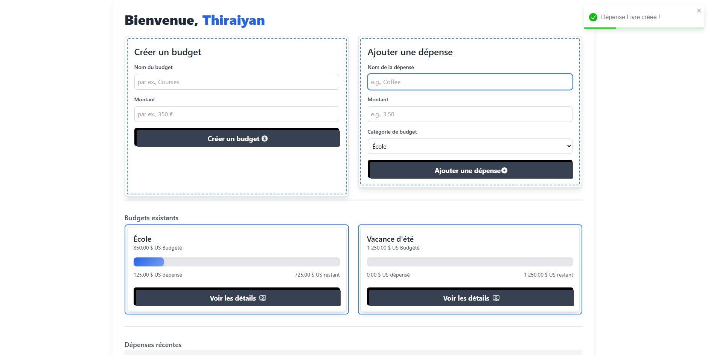

# 💰 Budget Tracking Web Application  

  
  

---

## 📌 Description  

Bienvenue sur mon application de suivi de budget !  
Cet outil a été conçu pour vous aider à gérer vos finances de manière simple et efficace. Grâce à une interface moderne et intuitive, il vous permet de créer des budgets, d’ajouter ou supprimer des dépenses, et de visualiser vos données financières sous forme de graphiques clairs.  

---

## ✨ Fonctionnalités principales  

- 📊 **Création de budgets** : Définissez des budgets personnalisés pour atteindre vos objectifs financiers.  
- 💸 **Gestion des dépenses** : Ajoutez, modifiez ou supprimez facilement vos dépenses.  
- 📈 **Dashboard moderne** : Visualisation intuitive avec des graphiques interactifs.  
- 📱 **Responsive Design** : Utilisable sur ordinateur, tablette et mobile.  

---

## 🧰 Technologies utilisées  

| Frontend        | Autres outils        |
|-----------------|----------------------|
|  |  |
|  | |

---

## 🖼️ Capture d’écran  

  

---

## 👨‍💻 Auteur  

**Thiraiyan Mooneesawmy**  

📌 Retrouvez-moi sur :  
-   
-   
